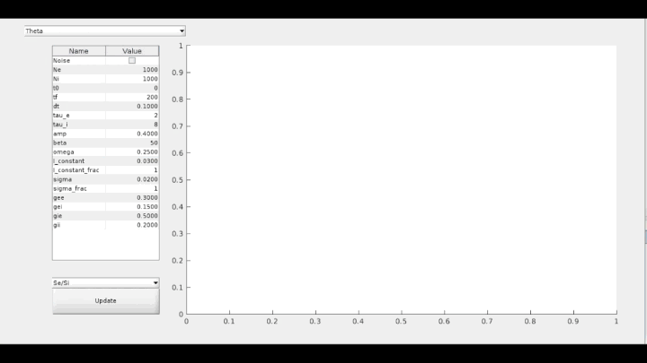

# Network GUI

## Overview


This is a GUI for simulating networks of neurons using the Theta or Ott-Antonsen models. It is most helpful for visualizing the effects of changing different parameters. Vectorized code is used to efficiently simulate large numbers of Theta neurons, while Ott-Antonsen uses math to even more efficiently simulate a large (infinite) number of Theta neurons. More details can be found in ```documentation.pdf```.

## Usage
### Method 1: From Code
If you have Matlab installed, you can download all code and run ```networkLayout.m```. Code was most recently tested on version R2021b.

### Method 2: Matlab Runtime
If you have Matlab Runtime installed, you can run ```GUI.exe```.

## Acknowledgments
Thanks to Jeffrey Chiou for providing code for [spike raster plotting](https://www.mathworks.com/matlabcentral/fileexchange/45671-flexible-and-fast-spike-raster-plotting), and thanks to Bard Ermentrout for explaining the math to me!